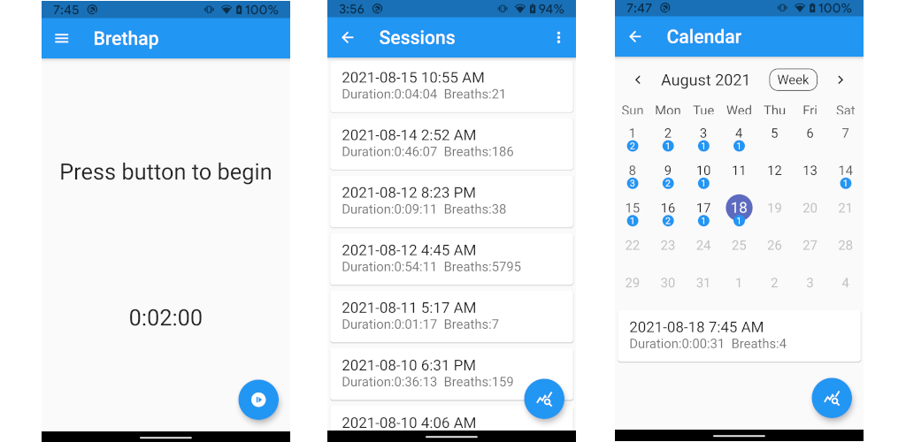

# Brethap

Brethap is yet another meditation app (yama). Including a timer for meditation, it also allows you to configure a breathing pattern for you to follow. Your sessions will be saved, allowing you to monitor and view stats about your progress in either a list or calendar view. Duration, breath and other options are configurable through saved preferences.

## Screenshots

