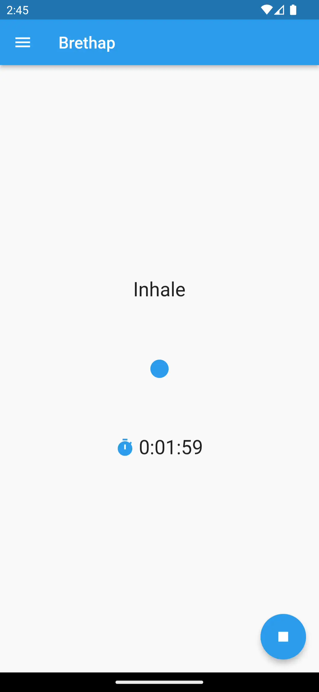

# Brethap

Brethap is yet another meditation app (yama). Including a timer for meditation, it also allows you to configure a breathing pattern for you to follow. Your sessions will be saved, allowing you to monitor and view stats about your progress in either a list or calendar view. Duration, breath and other options are configurable through saved preferences. Breathing technique presets include 4-7-8, physiological sigh, among others.

## Screenshots

## Usage

### Running
* To start a session, press the Start button
* To end a session, let the timer expire or press the Stop button

### Sessions
* To view sessions, press the drawer menu in the top left and press Sessions
* To view session stats, press the Stats button
* To remove a session, swipe a session either left or right

### Calendar
* To view a calendar display of sessions, press the drawer menu in the top left and press Calendar
* To view session stats for the month, press the Stats button
* To view sessions for the week only, press the Week button

### Preferences
* To view preferences, press the drawer menu in the top left and press Preferences
* To change a preference, move the preference slider either left or right or select a color
* To save a preference, hold down a Preference button
* To select a preset preference, press the Preference menu in the top right and select Presets
* To select a saved preference, press a Preference button

[TODO: update this page](https://github.com/jithware/brethap/issues/6)

## Donate

 | 
